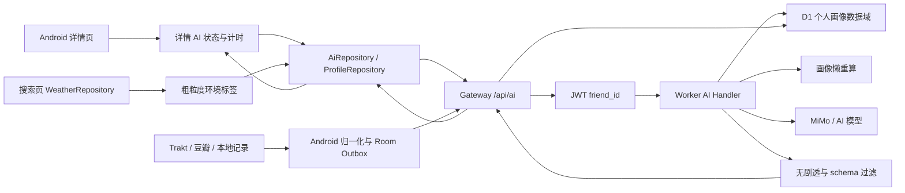

# 详情页 AI 精灵与个性化观影画像设计

## 1. 背景

在影视详情页增加 AI 精灵私人助理能力。对于用户尚未标记的影视，精灵根据用户的观影画像和当前影视信息，给出不剧透的兴趣判断、公共评分解读和观看建议；对于已看但缺少评分或短评的影视，精灵提醒用户补充真实感受；对于已完成评价的影视，精灵在相关推荐 Tab 中优先展示个性化推荐；对于已标记想看的影视，精灵结合时间、季节和可用天气信息给出低确定性的观看时机建议。

该功能同时建立按用户隔离的观影记录和派生口味画像，为后续个性化推荐和分析提供稳定的数据基础。

## 2. 已确认的决策

### 2.1 产品与权限

- 详情页 AI 只面向已激活 AI 精灵且已登录的用户。
- 首次触发详情页 AI 时，明确征得用户同意后才导入已有观影记录。
- 首次授权说明中分开呈现两类数据：观影画像和行为数据。行为数据默认不勾选。
- 关闭个性化后，不自动触发详情页 AI，也不展示依赖个人画像的新结果；详情页其他功能不受影响。
- 拒绝画像授权后，本次不再自动触发；用户主动点击精灵入口时可以重新查看授权说明。
- 设置页提供关闭个性化、暂停同步、清除 AI 画像/云端 AI 副本和清除行为数据的入口。

### 2.2 详情页交互

- 详情基础信息加载完成且页面处于前台后开始计时。
- 前台持续 3.5 秒后，只出现一次轻量悬浮精灵入口；不自动展开、不自动播放语音。
- 页面离开、进入后台、切换影视或用户关闭入口时取消本次计时/入口。
- 用户点击入口后，从底部展开 AI 面板，不改变详情正文布局；面板可以收起。
- 已有有效缓存时直接读取，不重复请求模型或消耗重复分析配额；手动刷新受服务端配额和冷却控制。
- 语音默认关闭，只在用户主动点击后播放；播放文本必须来自已经通过安全过滤的可见文本。

### 2.3 场景优先级

场景按以下顺序互斥选择：

1. 已看且评分、短评都存在。
2. 已看但评分或短评缺失。
3. 已标记想看。
4. 未标记。

同时存在“已看”和“想看”时按已看处理。已看但只缺一项评价时进入补充评价场景，不进入未知影视兴趣判断。

### 2.4 评价与推荐

- AI 不生成容易被误解为真实评分的数字分数。
- 公共评分继续显示豆瓣、TMDB、Trakt 等已有事实；AI 单独提供“你可能喜欢：高/中/低”和置信度。
- AI 不替用户生成或自动保存短评，只提醒用户记录真实感受并打开现有编辑面板。
- 已看且评分、短评完整时，用户进入相关推荐 Tab 后才懒加载 AI 精选。
- AI 精选置于现有相关推荐上方，展示 3-6 张卡片；与现有相关推荐去重后，现有推荐继续保留。
- 推荐只从已有规范化媒体 ID 的候选池中排序和生成理由，不凭空生成无法打开详情的影视。

### 2.5 天气与环境

- 详情页复用搜索页现有的天气授权、定位状态和 `WeatherRepository` 缓存。
- 详情页不新增天气权限请求，不向 AI 发送经纬度、精确位置或城市名称。
- 客户端把天气转换为粗粒度标签，例如晴/雨/雪、偏冷/舒适/炎热。
- 没有天气数据时退化为时间、星期和季节；不因天气缺失阻塞分析。
- 环境标签只影响想看场景的短期缓存，不写入长期口味画像。

## 3. 目标与非目标

### 3.1 目标

- 为每个授权用户建立可跨设备复用的观影记录和派生画像。
- 统一 Trakt、豆瓣和本地记录的媒体身份，同时保留来源原始值。
- 支持显式观影记录与经用户单独授权的行为信号，并区分置信度。
- 让 AI 请求在服务端组装用户画像上下文，客户端不重复上传完整历史。
- 让详情页 AI 失败、离线、配额不足或输出不安全时优雅降级。
- 保留旧 AI 功能和旧 `/api/ai/taste` 契约，降低兼容风险。

### 3.2 非目标

- V1 不把 AI 结论当作医学、人格、政治、宗教、性取向、收入等敏感属性推断。
- V1 不采集原始搜索词、键盘输入、页面截图或完整操作流水。
- V1 不自动修改想看/已看状态，不自动启动播放。
- V1 不把公共评论作为用户画像数据；只处理用户自己写的短评。
- V1 不把详情页 3.5 秒自动入口本身视为喜欢信号。
- V1 不替换现有 Trakt、豆瓣同步和详情页评分/短评存储。

## 4. 总体架构



### 4.1 存储边界

- Worker D1 是 AI 画像主库，负责按 `friend_id` 隔离、查询、版本和删除。
- Android Room 是离线镜像和待同步队列，不替换现有评分、短评、标记和豆瓣同步表。
- 现有 Gitee 个人同步继续承担既有业务职责，不混入 AI 私密画像数据。
- AI 生成结果可以复用现有 `ai_cache`，但新增缓存键必须包含场景和画像版本。
- MiMo 凭据仍只由 Worker 读取，Android 只调用网关。

### 4.2 身份与鉴权

- 所有个人画像接口必须经过现有 JWT 校验。
- Worker 从 JWT 的 `sub` 获取 `friend_id`，不信任客户端传入的用户 ID。
- 所有 D1 查询和写入都必须带当前 `friend_id` 条件或通过外键约束隔离。
- 更换账号、撤销授权和清除本地 AI 数据时，客户端清理对应用户的加密 AI 缓存；服务端删除由独立数据控制接口完成。

## 5. 媒体身份与来源合并

### 5.1 统一媒体身份

内部媒体主键优先使用：

```text
media_key = "{media_type}:{tmdb_id}"
```

其中 `media_type` 只能是 `movie` 或 `show`。TMDB ID 不存在时，使用可靠的 IMDb、Trakt 或豆瓣映射作为备用身份，但不得使用标题作为唯一主键。

每条记录同时保留：

- TMDB、IMDb、Trakt、豆瓣 ID；
- 电影/剧集类型；
- 标题、年份等当时的展示快照；
- 原始来源；
- 来源更新时间和客户端写入时间。

无法可靠映射的记录保留为独立来源记录，不强行合并。后续获得可靠 ID 映射时，再通过显式迁移合并，并保留来源历史。

### 5.2 来源状态

同一影视的 Trakt、豆瓣、本地记录分别保留原始值。统一层计算供 AI 使用的有效状态：

- 显式用户操作优先于同步导入；
- 最近更新时间只解决同一来源内的冲突，不覆盖其他来源原值；
- 统一状态可以是想看、已看、两者同时存在或无当前标记；
- 评分保留来源原始量程，进入 AI 上下文前转换为统一 10 分制并标注来源；
- 短评只保存和分析用户自己的文本。

### 5.3 删除和取消

取消标记、删除短评和清除来源值都写入 tombstone，而不是省略字段。tombstone 至少包含来源、媒体身份、删除字段、操作时间和同步批次。

- 服务端确认 tombstone 后，统一有效状态才清除；
- tombstone 在足够长的离线同步窗口后清理；
- 旧设备重放过期数据时不得复活已删除状态；
- 清除 AI 数据不影响 Trakt、豆瓣等原始账户数据。

## 6. D1 数据模型

以下表名和字段是行为契约。实现时可以在不改变语义的前提下调整物理字段，但不能移除用户隔离、来源保留、版本和幂等能力。

### 6.1 `ai_profile_settings`

每个 `friend_id` 一行：

- `friend_id`：主键，关联 `friends(id)`；
- `profile_consent`：是否同意使用显式观影记录建立画像；
- `behavior_consent`：是否同意使用停留、点击和播放等行为信号；
- `personalization_enabled`：是否启用个性化 AI；
- `sync_enabled`：是否允许继续同步个人画像数据；
- `consent_version`：用户确认过的说明版本；
- `created_at`、`updated_at`。

关闭个性化不删除数据；清除操作通过数据控制接口执行。行为开关关闭后，历史行为立即停止参与新的画像和推荐，用户可以单独清除行为数据。

### 6.2 `ai_profile_media`

按用户保存统一媒体身份和展示快照：

- `friend_id`、`media_key`：联合主键；
- `media_type`、`tmdb_id`、`imdb_id`、`trakt_id`、`douban_id`；
- `title`、`year`、`poster_url`；
- `effective_watchlist`、`effective_watched`；
- `effective_rating`、`effective_comment_present`；
- `last_explicit_at`、`last_derived_at`、`updated_at`。

索引至少覆盖 `(friend_id, updated_at)`、`(friend_id, media_type)` 和各规范化媒体 ID。有效状态是派生值，来源原始值仍在来源表中。

### 6.3 `ai_profile_media_sources`

每个用户、媒体和来源一行：

- `friend_id`、`media_key`、`source`：联合唯一键；
- `source_media_id`；
- 来源标记：`watchlist`、`watched`；
- `rating`、`rating_scale`、`comment_text`、`watched_at`；
- `source_updated_at`、`client_updated_at`；
- `tombstone_json` 或等价的结构化删除字段；
- `updated_at`。

来源值只由同步归一化层写入，AI 读取统一有效视图或等价查询结果。

### 6.4 `ai_profile_behavior_daily`

行为只保存按影视和日期聚合的低敏信号：

- `friend_id`、`media_key`、`event_day`：联合主键；
- `detail_dwell_bucket`：有效前台停留时长桶；
- `search_click_count`；
- `player_progress_buckets`：25%、50%、75%、完成等区间计数；
- `episode_completed_count`；
- `episode_started_count`；
- `last_event_at`；
- `updated_at`。

不保存原始搜索词、输入内容、截图、完整点击流水或精确播放时间线。行为上报前在客户端聚合，服务端再次限制字段范围和单日计数上限。

初始行为规则：

- 前台有效停留默认至少 10 秒才计入，3.5 秒入口不计入；
- 停留按 `<10 秒`、`10-30 秒`、`30-120 秒`、`>120 秒`分桶；
- 单次搜索点击是低权重兴趣信号；
- 暂停、退出和跳过不直接判定为不喜欢；
- 行为连续 90 天没有重复出现时按半衰规则降低影响；
- Trakt 已同步的单集观看历史属于观看事实，可以在显式画像授权后导入；应用内播放器进度和搜索/停留行为需要行为授权。

### 6.5 `ai_profile_snapshot`

每个用户当前一行：

- `friend_id`：主键；
- `profile_version`：单调递增；
- `status`：`PENDING`、`READY` 或 `FAILED`；
- `profile_json`：结构化偏好标签、依据、置信度和统计摘要；
- `source_watermark`：已纳入的记录/行为版本；
- `generated_at`、`updated_at`。

画像重算不阻塞观影记录写入。同步成功后标记 `PENDING`，下次详情 AI 请求或后台批处理合并短时间内的多次变化后再重算。画像版本变化会使相关详情和推荐缓存失效。

### 6.6 `ai_profile_feedback`

保存用户对画像的纠正：

- `friend_id`、`media_key`、`feedback_type`：联合唯一键；
- V1 支持 `NOT_REPRESENTATIVE`；
- `created_at`、`updated_at`。

画像页面展示标签、依据和置信度；用户可以标记某条记录“不代表我的口味”、重置画像或清除数据，但不直接编辑模型结论。

### 6.7 `ai_profile_sync_batches`

用于 outbox 批次幂等：

- `friend_id`、`batch_id`：联合主键；
- `schema_version`、`payload_digest`；
- `status`：`ACCEPTED` 或 `REJECTED`；
- `created_at`、`processed_at`。

同一用户重复提交同一批次时返回原处理结果，不重复增加行为计数；相同 `batch_id` 搭配不同摘要时拒绝并记录安全事件。

## 7. Android 本地模型与同步

### 7.1 Room 镜像

新增画像镜像、行为日聚合和 outbox 实体，按当前用户的 `friend_id` 隔离。现有 `UserReviewEntity`、`MarkActionRecordEntity`、豆瓣同步实体和 Trakt 缓存继续作为各自业务的事实来源，不做破坏性替换。

本地 outbox 保存：

- 客户端批次 ID和 schema 版本；
- 归一化媒体记录变更；
- 来源字段变更和 tombstone；
- 行为日聚合增量；
- 重试次数、下次重试时间和最后错误分类。

网络可用时按批次上传；失败进入待同步队列，不阻塞详情页。切换账号或撤销授权时，停止旧账号上传并清理旧账号的本地 AI 镜像和缓存。

### 7.2 首次导入

首次用户同意观影画像后：

1. 从现有 Trakt、豆瓣和本地仓库读取可用记录；
2. 通过可靠 ID 归一化为 `media_key`；
3. 保留来源原始值和来源更新时间；
4. 写入 Room outbox；
5. 上传 D1 并等待服务端确认；
6. 画像标记为 `PENDING`，不阻塞用户浏览详情。

用户没有同意时不导入、不上传，也不自动调用个人分析。用户之后在设置中开启时可以重新开始导入；清除后不会自动重新导入，除非用户再次确认。

### 7.3 行为采集

新增统一的客户端行为聚合器，但不在行为发生时逐条联网：

- 详情页只累计有效前台停留桶和主动打开/继续行为；
- 搜索页只记录结果媒体 ID 的点击次数，不记录原始搜索词；
- 播放器接入后只写进度桶、开始/完成次数；
- 单集观看事实优先复用现有 Trakt 历史和进度接口；
- 行为开关关闭后立即停止新采集和新上报；
- 聚合器写入 Room，按时间或数量阈值批量上传。

## 8. Worker API 契约

所有响应继续使用现有 `AiApiResponse<T>` 包装、`requestId` 和配额字段；Android Retrofit 继续采用 `@POST`、`@Body`、`suspend` 和 `Response<AiApiResponse<T>>`。

### 8.1 画像设置

```text
GET /api/ai/profile/settings
PUT /api/ai/profile/settings
```

设置响应包含画像同意状态、行为同意状态、个性化/同步开关、画像版本和画像状态。写入设置必须带 `consentVersion`，服务端只接受已知版本；关闭开关不能误删原始来源数据。

### 8.2 画像同步

```text
POST /api/ai/profile/sync
```

请求包含客户端批次 ID、schema 版本、媒体来源变更、tombstone 和行为日聚合。服务端执行：

1. 校验 JWT、批次 ID、字段长度和计数上限；
2. 校验媒体 ID 组合和媒体类型；
3. 在一次 D1 batch 中写入来源记录、行为聚合、有效状态和批次幂等记录；
4. 将画像状态标记为 `PENDING`；
5. 返回接受结果、当前画像版本和待更新状态。

请求不得包含完整客户端历史作为每次 AI 上下文；同步只发送新增、修改和删除批次。

### 8.3 画像摘要与删除

```text
GET /api/ai/profile
DELETE /api/ai/profile/{scope}
```

`scope` 支持 `behavior`、`profile` 和 `all`：

- `behavior`：删除行为日聚合并使其不再参与画像；
- `profile`：删除画像快照、画像派生缓存和个人 AI 结果，不删除 Trakt/豆瓣原始账户数据；
- `all`：删除上述 AI 画像域数据和个人 AI 缓存。

删除成功后不自动重新导入；客户端清除对应 Room 镜像、outbox 和加密缓存。

### 8.4 详情分析

```text
POST /api/ai/detail/analyze
```

请求包含：

- 当前影视 `mediaKey`、类型、标题、年份和规范化 ID；
- 应用已有的类型、简介、导演、主演和公共评分；
- 当前场景：`UNMARKED`、`WATCHED_NEEDS_REVIEW` 或 `WATCHLIST_CONTEXT`；
- 粗粒度环境：本地日期、星期、时段、季节和天气标签；
- `forceRefresh` 和客户端 schema 版本。

客户端不发送完整观影历史、精确位置或原始行为流水。Worker 从 D1 读取当前用户有效画像和必要的用户记录。

响应结构：

```json
{
  "scene": "UNMARKED",
  "interestLevel": "HIGH",
  "confidence": "MEDIUM",
  "spoilerFreeIntro": "...",
  "publicRatingSummary": "...",
  "watchAdvice": "...",
  "basis": ["偏好的类型与该片相近", "你曾给相似节奏作品较高评价"],
  "watchNowLevel": null,
  "environmentBasis": [],
  "profileVersion": 12
}
```

`WATCHLIST_CONTEXT` 才返回 `watchNowLevel` 和 `environmentBasis`。AI 不返回预测数字评分；数据不足时返回低置信度和明确的“不足以判断”文案。

### 8.5 AI 精选推荐

```text
POST /api/ai/recommendations/rank
```

V1 候选池由现有详情推荐接口提供，Android 发送已具有规范化媒体 ID 的候选卡片；Worker 负责读取用户画像、排除当前影视和已有记录、再次校验字段并让 AI 只排序候选。候选不足时直接返回空 AI 精选，现有相关推荐仍显示。

每个返回项必须包含可用于详情路由的 TMDB、Trakt、IMDb 或豆瓣身份中的可靠 ID，以及简短无剧透推荐理由。纯标题、无法映射或无法通过候选校验的模型输出被丢弃。

## 9. 缓存与配额

### 9.1 客户端缓存

继续使用现有 `AiStorage` 加密缓存和按用户隔离的 key 规则。新增缓存特征至少包括详情分析和 AI 精选推荐，缓存 key 组成如下：

```text
detail:{mediaKey}:{scene}:{profileVersion}:{environmentKey}
recommendations:{mediaKey}:{profileVersion}:{candidateDigest}
```

`environmentKey` 只在想看场景使用，包含本地日期、时段、季节和天气标签，不包含坐标。

### 9.2 Worker 缓存

复用现有 `ai_cache` 的用户隔离能力，新增 kind 和版本化 cache key。缓存命中不进行模型推理；客户端优先命中本地缓存，避免无意义请求。手动强制刷新必须重新校验配额、冷却和用户开关。

画像版本变化时：

- 未标记兴趣分析和已评价推荐缓存失效；
- 想看场景的短期环境缓存按日期/环境 key 自然失效；
- 公共影视事实缓存不因画像变化而失效。

### 9.3 失败降级

- 网络失败、Worker 失败、模型超时、输出 schema 错误和配额耗尽都不影响详情页其他内容；
- 已有缓存继续可读；
- 首次失败只显示轻量“暂时无法分析”和手动重试；
- 不自动循环重试，不弹阻塞式错误；
- 推荐 AI 失败时保留现有相关推荐；
- 无画像或画像数据不足时降低结论强度，不伪装成精准个性化。

## 10. AI 内容安全与可解释性

### 10.1 输入边界

影视事实只来自应用已有结构化详情，包括标题、类型、年份、简介、导演、主演和公共评分。AI 不自由补充未经验证的剧情事实，不读取公共评论作为用户口味依据。

### 10.2 输出边界

Worker 要求模型返回固定 JSON，并执行字段、长度、枚举和 ID 校验。输出只允许包含：

- 匹配度及置信度；
- 无剧透简介；
- 公共评分解读；
- 观看建议；
- 简短、可验证的判断依据；
- 想看场景的环境依据；
- 推荐卡片理由。

禁止结局、反转、关键关系、角色生死、关键秘密和其他会破坏首次观看体验的信息。发现疑似剧透时丢弃风险字段并返回保守文案，不强行展示原文。

AI 不展示内部思维链，只展示有限长度的理由摘要。任何画像输出不得推断健康、政治、宗教、性取向、收入、人格诊断或其他敏感属性。

### 10.3 画像可解释性

画像页面至少展示：

- 偏好标签；
- 代表性依据类型；
- 置信度；
- 最近更新时间和画像版本；
- 用户标记“不代表我的口味”的操作；
- 重置和清除入口。

低置信度行为不能覆盖高置信度的评分、短评和完成观看事实。短暂停留、暂停播放、退出详情和跳过单集不能单独构成负面结论。

## 11. 详情页实现边界

建议新增独立的详情 AI 状态边界，避免继续扩大现有详情 ViewModel 的职责：

- `AiProfileRepository`：画像设置、首次导入、Room outbox、同步和数据控制；
- `AiRepository`：保留现有激活、问候、口味和闯关能力，新增详情分析与推荐排序请求；
- `DetailAiViewModel` 或等价的详情级状态协调器：场景判定、3.5 秒计时、请求取消、缓存和底部面板状态；
- 现有 AI 精灵视觉组件复用 `AiSpriteOverlay`/`AiSpriteCenter` 的角色和动画约定；
- 现有 `DetailViewModel` 继续拥有影视详情、标记、评分和短评事实，详情 AI 通过不可变快照读取这些状态；
- `WeatherRepository` 由详情 AI 协调器消费，使用搜索页已经获得的授权和缓存结果；
- 推荐卡片继续走现有详情路由和 `RecommendationItem` 的规范化 ID。

详情 AI 请求必须绑定 `mediaKey` 和请求代次。影视切换、页面离开或状态重置时取消请求；即使底层请求无法立即取消，返回结果也必须因代次不匹配而被丢弃。

所有用户可见文案通过 `stringResource` 和四套 `strings.xml` 提供：`values`、`values-zh`、`values-ja`、`values-ko`。ViewModel/Worker 内部错误保持英文，UI 展示由错误类型映射到本地化文案。

## 12. 分阶段交付

### 阶段 1：画像基础

范围：

- D1 表、索引、迁移和用户隔离；
- Room 镜像、outbox、批次幂等和 tombstone；
- Trakt/豆瓣/本地媒体归一化；
- 首次授权与历史导入；
- 增量同步、暂停同步、清除画像和行为数据；
- 画像状态与版本；
- 设置页授权、开关和帮助/隐私说明。

阶段 1 不在详情页展示新的 AI 分析，先验证数据契约和可删除性。

### 阶段 2：详情页助理

范围：

- 3.5 秒前台计时和一次性悬浮入口；
- 底部 AI 面板；
- 未标记、已看未评价和想看三类场景；
- 粗粒度时间/季节/天气标签；
- 画像版本缓存、手动刷新和离线降级；
- 无剧透结构化输出；
- 默认静音和手动语音播放。

阶段 2 不生成相关推荐 AI 精选，相关推荐保持现状。

### 阶段 3：相关推荐 AI 精选

范围：

- 相关推荐 Tab 懒加载；
- 复用现有候选池；
- AI 排序、理由和 3-6 张精选卡片；
- 媒体 ID 校验、已有记录排除和去重；
- “不代表我的口味”反馈；
- 推荐缓存和画像版本失效。

## 13. 测试与验收

### 13.1 Worker

- D1 migration、索引和外键；
- 不同 `friend_id` 的读写隔离；
- 同步批次幂等和重复行为不计数；
- 来源冲突、统一状态和 tombstone 不复活；
- 画像 pending/ready/failed 和版本递增；
- 设置开关、删除 scope 和清除后不自动导入；
- 输出 JSON schema、无剧透过滤、敏感属性禁止；
- 候选 ID 校验、当前影视/已有记录排除和推荐去重；
- cache key、画像版本失效、配额和手动刷新；
- 未授权、关闭个性化和错误降级。

### 13.2 Android

- DTO 与 Worker 契约测试；
- 媒体归一化、来源冲突和 outbox；
- Room migration、账号切换和缓存清理；
- 3.5 秒计时的前台/后台、离开、关闭和影视切换；
- 场景优先级和状态矩阵；
- 请求代次取消及旧结果丢弃；
- 缓存命中、手动刷新和离线展示；
- 天气已授权/未授权路径；
- 评分/短评面板只由用户主动编辑；
- 四套国际化资源和语音手动播放。

### 13.3 集成与设备验收

- 首次授权导入、断网恢复、跨设备修改和清除数据；
- 详情页三类场景完整流转；
- 快速切换详情不串结果；
- AI 失败不影响原详情页；
- 推荐卡片可以打开有效详情且不重复；
- 登录/激活、后台切换、天气已授权/未授权和手动语音播放；
- 记录设备分辨率、API、安装结果、启动页、UI 树、截图和 `logcat -b crash`。

每个阶段通过针对性测试后独立提交，提交前执行 `git diff --cached --check` 并检查暂存文件列表，避免混入截图、构建产物、临时目录或敏感配置。

## 14. 风险与控制

| 风险 | 控制措施 |
| --- | --- |
| 行为数据过度推断 | 独立同意、聚合存储、低权重、时间衰减和可清除 |
| 来源 ID 冲突 | 可靠 ID 优先、来源原值保留、标题不作主键 |
| 离线设备复活旧状态 | tombstone、来源更新时间和批次幂等 |
| AI 幻觉或剧透 | 结构化事实输入、固定 schema、后端过滤和保守回退 |
| 推荐卡片无法打开 | 候选池约束、ID 校验和现有详情路由复用 |
| AI 成本失控 | 3.5 秒只展示入口、Tab 懒加载、本地/Worker 缓存、批量画像重算 |
| 详情页回归 | 独立详情 AI 状态边界、错误隔离和阶段性发布 |
| 隐私数据残留 | D1 scope 删除、Room/加密缓存同步清理、清除后不自动导入 |

## 15. 设计结论

本方案把 AI 精灵从单次口味分析扩展为按用户隔离的长期观影助理，但将三类边界保持清晰：

1. 观影事实、行为信号和 AI 派生画像分层保存；
2. 公共评分、个性化匹配度和低确定性观看时机建议分开表达；
3. 详情页入口、AI 分析和相关推荐精选分阶段加载，失败不影响原有详情功能。

实现阶段应先完成阶段 1 的数据契约、隐私控制和迁移测试，再进入详情页 UI；不得先把用户历史直接拼进模型提示词后再补数据治理。
